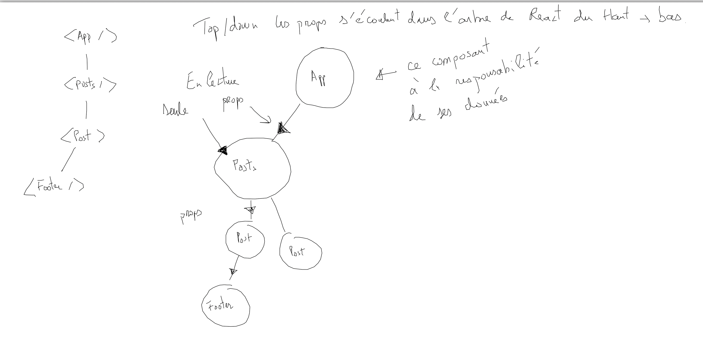

# Les props

Que l'on définisse un composant avec une classe ou une fonction, les props sont en lecture seule.

La philosophie des développeurs de Facebook a imposée cette rigueur au niveau de ces valeurs. Les props s'écoulent du haut vers le bas et une fois entrées dans un composant depuis un parent ne peuvent être changées par l'enfant. C'est pour cela qu'on dit qu'une props est en **LECTURE SEULE** dans un composant donné.



Les props peuvent se définir dans les attributs des composants sous forme de clés/valeurs :

```js
  <Hello name="Alan" />
```

Elles seront récupérées dans les arguments de la fonction du composant :

```js
const Hello = (props) => {
  // porps.name = "Autre chose" IMPOSSIBLE

  return <h1>Hello, {props.name}</h1>;
}
```

Vous pouvez également définir un composant avec une classe ES6. La classe devra étendre de React.Component, le nom de la classe est le nom du composant.
**Mais attention là encore les props sont en lecture seule**. Par la suite nous utiliserons des classes pour créer des composants. Elles sont plus faciles à manipuler pour définir un composant au début que les fonctions dans React.

```js
class HelloReact extends React.Component{

  // on récupère la props en lecture depuis l'objet (composant) HelloReact
  // ON NE PEUT PAS MODIFIER LA PROPS this.props.name = "Sophie" IMPOSSIBLE !
  render() {
      return (
         <p>{this.props.name}</p>
      )
  }
}

ReactDOM.render(
    // attribut cle/valeur == props
    <HelloReact name="Hello React" />,
    document.getElementById('root')
);
```

### 01 Exercice message

Définissez une constante "messages" dans le composant App, qui contiendra des messages, puis créez un composant Messages et un autre composant Message qui affichera les messages se trouvant dans la constante. Récupérez les messages dans la constantes suivantes :

```js
 const MESSAGES = [
        { message : "React JS" },
        { message : "React Native" },
        { message : "Angular" },
        { message : "Symfony" },
        { message : "MongoDB" },
    ];
```

Vous pouvez en effet avoir un composant dans un composant. Les composants de React sont déclaratifs comme les balises HTML.

### Hiérarchie des compostans

```txt
    App
     .
     .
  Messages
     .
     .
  Message
```

**Indications** : créez trois classes dans le même fichier. Utilisez la source ex1_props.html du cours pour commencer. Et n'oubliez pas d'utiliser map pour parcourir les messages et les afficher.

## 02 Exercice average

Soient les données suivantes :

```js
const students = [
  { notes: [12, 11, 10], name: "Alan" },
  { notes: [18, 10, 19], name: "Alice" },
  { notes: [10, 9, 11], name: "Bernard" },
  { notes: [11, 17, 19], name: "Sophie" },
];
```

Créez deux composants et affichez pour chaque étudiant son nom et sa moyenne dans une liste ul/li.

### Hiérarchie des compostans

```txt
    App
     .
     .
  Student
```

## 03 Data fruits

Faites cet exercice dans un fichier index_fruits.html

Soient les données suivantes :

```js
const products = [
  { prices: [1.2, 1.1, 1.0], name: "apple" },
  { prices: [1.8, 1.0, 1.9], name: "oragne" },
  { prices: [1.0, 0.9, 1.1], name: "bananas" },
];
```

1. Affichez l'ensemble des prix de chaque fruit.

2. Faites la moyenne des prix des fruits, arrondi à une décimale après la virgule.

```txt

apple
  prices :
    1.2
    1.1
    1.0
  average : 1.1

oragne
  prices :
    1.8
    1.0
    1.9
  average :  1.6

...
```

## 04 Exercice Clock

Importez les dépendances classiques pour interpréter le code React dans votre fichier index.html.

Définir un composant Clock et essayez d'implémenter une horologe. Faites en sorte que dans le DOM l'horloge se mette à jour et affiche les secondes, minutes et heures qui passent.

Remarques : vous pouvez utiliser un setInterval JS pour re-lancer le rendu (ReadDOM).

```txt
  10h 25m 30s
```
