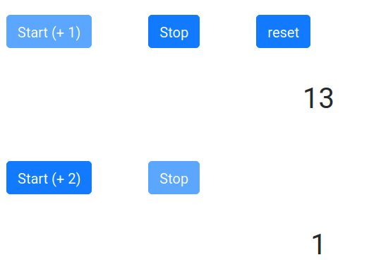

# Challenge 01 Counter

Créez deux compteurs (composants) qui se déclenchent à l'aide d'un bouton **start**. Le premier compteur s'incrémente de +1, le deuxième compteur s'incrémente de +2. Vous pouvez jouer avec les props des composants pour fixer la valeur de l'incrémentation, chaque composant aura ainsi sa propre configuration.

Associez pour chaque compteur un bouton stop qui permet d'arrêter le compteur correspondant.

Mettez une propriété **disabled** sur le start et le stop, disabled sera placé sur stop si on n'a pas appuyé sur start et réciproquement.

Options possibles à notre exercice

- Les compteurs doivent tous s'arrêter lorsqu'ils atteignent 20, vous pouvez soit tout ré-initialiser, soit arrêter le compteur et laisser la valeur la valeur 20 affichée. 

- Si vous avez le temps développer un compteur cyclique et un compteur binaire.

