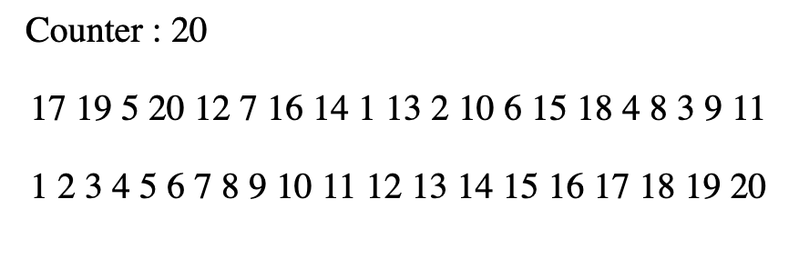
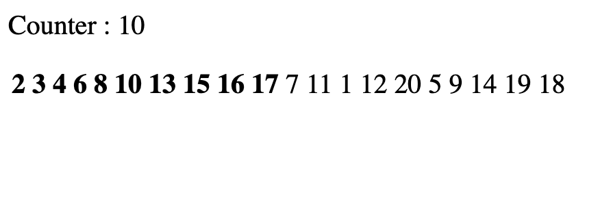

# Challenge

## Partie 1

Pour ce challenge vous utiliserez un fichier unique index.html en important l'ensemble des dépendances.

1. Créez une fonction JS permettant de générer un tableau d'entiers de 1 à 20 de manière aléatoire. Chaque valeur de ce tableau sera unique.

```js
let numbers = generate();
// Par exemple, numbers vaut 

[
   4, 14, 20, 6, 11, 12, 13,
   5, 16, 10, 3, 15,  2, 18,
  19,  8, 17, 1,  9,  7
]
```

2. Affichez ces valeurs dans le DOM à l'aide de React, centrez l'affichage des valeurs au centre de la page sur une ligne.

## Partie 2

Ordonnez la liste pas à pas. Une fois la liste de nombres affichée, ordonnez-la en affichant les valeurs toutes les secondes sous la première liste (non-ordonnées).



## Partie 3 (faculative)

Reprennez l'exercice précédent dans une nouvelle version et ordonnez la liste de valeurs pas à pas en modifiant à chaque fois la liste de valeurs.


